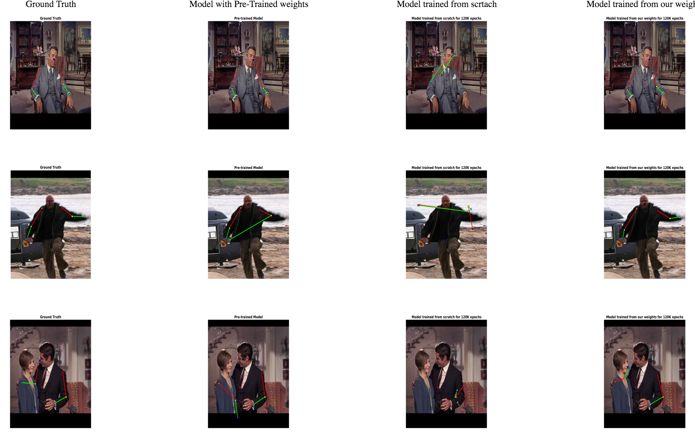

# Fine Tune Human Pose Estimation using CNN

Tech report of my work: [Report](https://drive.google.com/open?id=0B0XN6u3to2v8bnhiZlc0bVpod2M)

Fine tune human pose estimation using sign language videos downloaded from Youtube.

### Training Data
* Data: Frames from videos
* Labels: Encoded vectors of subtitles of those videos

### Fine tune on FLIC dataset.
* Data: Images
* Labels: Joint Coordinates

Detailed description is given in the report.

##### Here is an example of my result:
* Col1: Ground Truth
* Col2: Model weights downloaded from original authors of the paper given at the bottom
* Col3: Model trained from scratch on FLIC
* Col4: Model fine-tuned with weights from training of sign-langugage videos [my work]

This work was mostly based on this paper: http://www.robots.ox.ac.uk/~vgg/publications/2015/Pfister15a/pfister15a.pdf

